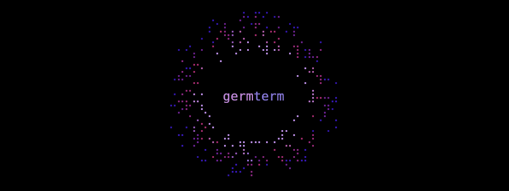

<p align="center">
  
</p>

<div align="center">

[](https://www.rust-lang.org/)
[](https://crates.io/crates/germterm/)
[](https://mit-license.org/)
[](https://github.com/thehuglet/germterm/actions)

</div>

A lightweight, high-performance terminal graphics framework written in Rust. It renders in real time and supports drawing with transparency through alpha blending, all through a simple to use API.

## Features

- Full alpha blending support, with true color RGBA encoded colors
- High performance rendering pipeline with minimal allocations optimized for cache locality
- Supports drawing with depth using layers
- Supports multiple drawing formats
  - Standard - Full control over the `char`, `fg`, `bg` and `attributes`
  - Twoxel - Allows drawing 2 independent pixels inside a single terminal cell
  - Octad - Allows drawing in 8 distinct sub-pixel positions using braille characters
- Built-in particle system with approximated physics
- Built-in FPS limiter with access to delta timing
- Crossplatform ([crossterm](https://github.com/crossterm-rs/crossterm) backend)
- Simple to use API

## Getting started

See the [examples](examples/) directory for more advanced examples.

```rust
use germterm::{
    color::Color,
    crossterm::event::{Event, KeyCode, KeyEvent},
    draw::{Layer, draw_text, fill_screen},
    engine::{Engine, end_frame, exit_cleanup, init, start_frame},
    fps_counter::draw_fps_counter,
    input::poll_input,
};
use std::io;

fn main() -> io::Result<()> {
    let mut engine = Engine::new(40, 20).limit_fps(60);
    let mut layer = Layer::new(&mut engine, 0);

    init(&mut engine)?;

    'update_loop: loop {
        start_frame(&mut engine);

        for event in poll_input() {
            if let Event::Key(KeyEvent {
                code: KeyCode::Char('q'),
                ..
            }) = event
            {
                break 'update_loop;
            }
        }

        // Draw contents
        fill_screen(&mut layer, Color::BLACK);
        draw_text(&mut layer, 14, 9, "Hello world!");
        draw_fps_counter(&mut layer, 0, 0);

        end_frame(&mut engine)?;
    }

    exit_cleanup(&mut engine)?;
    Ok(())
}
```

## Dependencies

This project only uses `crossterm`, `bitflags` and `rand` as its dependencies.
