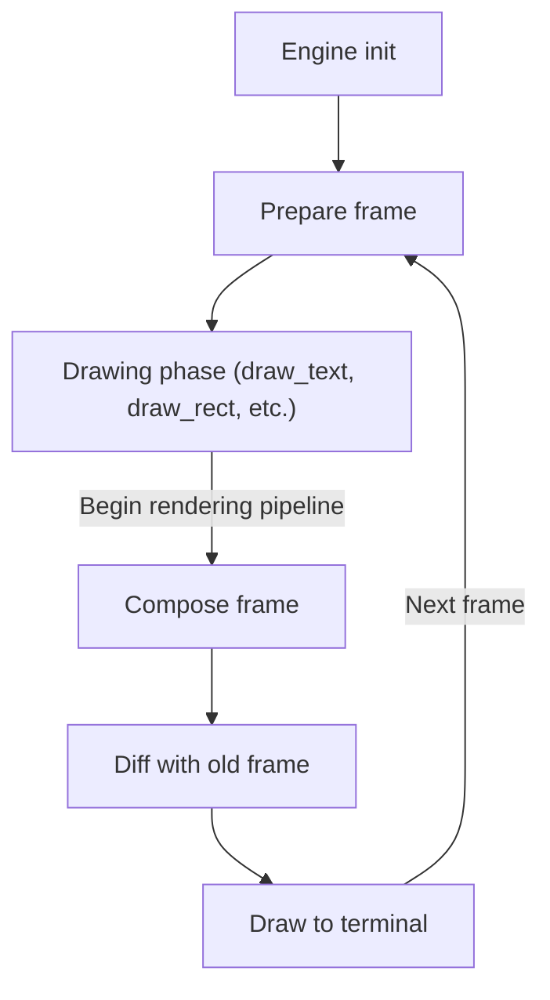

# Rendering Pipeline - Architecture & Design

## Reusing structures to avoid allocations

After the drawing phase, the pipeline performs zero allocations, provided the pre-allocated buffers are large enough to hold all draw calls.

To avoid allocating on every frame, we only allocate data structures once and reuse them between frames. This requires additional bookkeeping to ensure unwanted state from the previous frame does not overflow into the current frame, but results in a sizeable performance boost when done correctly.

The following data structures are reused by the rendering pipeline:

- `engine.frame.layered_draw_queue`
- `engine.frame.current_frame_buffer`

## Layers

Each layer internally is a `Vec<DrawCall>` and represents a draw queue. `DrawCall`s are intended to be pushed into a layer (amortized O(1)).

All layers are stored inside a `Vec` (`engine.frame.layered_draw_queue`). This gives us a final data structure of `Vec<Vec<DrawCall>>`.

### Justifying storing layers in a `Vec`

There are 2 reasons behind this choice, both tied to performance.

- **O(1) access** - As explained in [Drawing functions](#drawing-functions), `DrawCall`s are pushed to a specified layer, which first requires accessing it. `Vec` excels here in terms of performance with O(1) access. The only downside is ensuring the layer exists.
- **Fast iteration** - A Vec<Vec<DrawCall>> can be efficiently flattened into an iterator using `flat_map`.

## Drawing functions

Drawing functions (`draw_text`, `draw_rect`, etc.) only ever push `DrawCall`s to a specified layer. I don't expect any operation other than pushing to be used here.

## Compositor

A core design goal was full alpha blending support using the source over blending algorithm. Everything is built around that decision.

The main responsibility of the compositor is turning raw draw calls into a flat `FrameBuffer` containing each pixel of the frame.
This is achieved by iterating a `&[DrawCall]`, taking each individual cell of a `DrawCall`, comparing it to what's already been drawn this frame, and outputting a new cell based on predefined set of rules.

### **`fg` and `bg` channels don't follow conventional terminal logic**

The following examples demonstrate how this library diverges from traditional terminal rendering:

- A 50% opacity `bg` would normally only affect the background channel underneath, here however it will blend `bg` with both `fg` and `bg`, making the `fg` appear "behind" the `bg`
- A 0% opacity `fg` will not be drawn, keeping the old `fg`

## Diffing frame buffers

Diffing the previous and current frame buffer allows us to both avoid flickering and increase performance substantially by only drawing the contents that changed from the previous frame. This step returns an iterator over `DiffProduct` items, which contains a `Cell` and the position on screen.

## Justifying `Attributes::NO_{FG/BG}_COLOR` over `Option<Color>`

**Problem**: We need a way to represent absence of color, to "erase" a cell, restoring the terminal default. We can't use a color with 0% alpha for this, as 0% alpha means keeping the color underneath, not erasing it.

**The obvious solution**: Using `Option<T>`, which would leave us with an `Option<Color>`. This works, but doubles the size of `Color` since Rust can't use a niche optimization which costs us 1 byte + 3 bytes of padding, resulting in 8 bytes compared to the original 4 bytes.

**The solution I chose**: I decided to store this information in 2 bits of `Attributes` in order to avoid sacrificing performance.
