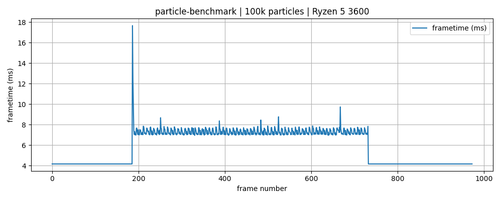

# particle-benchmark

A simple benchmark that spawns 100k particles. Frametimes are saved in a `frametimes.csv` file on exit.

Below is a plotted benchmark ran on a Ryzen 5 3600. The idle framerate is capped at 240 FPS (~4 ms). Under load the average framerate is around 125 FPS (~7-8 ms).

> Note: the plot uses values from a second spawn in the same run.
> 
> This has been done to filter out the one-time cost of growing the particle state vector.
> 
>With the cost of growing the initial spike is around 30ms for one frame (compared to the ~18ms on the plot above).
