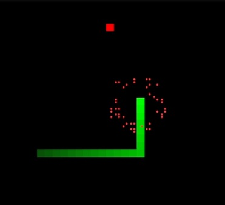

# twoxel-snake

Snake implemented using the engine's built-in features:

- Uses twoxels for each pixel, resulting in doubled vertical resolution
- Uses the particle system to spawn an explosion upon collecting an apple
- Uses the built in color gradients to dynamically sample colors of the snake segments
